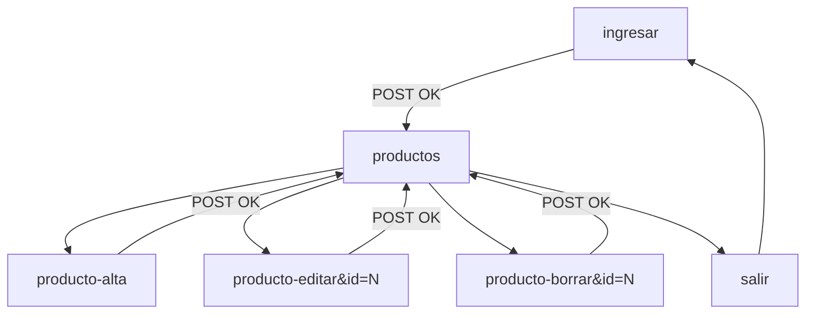

# Contrato frontend — Panel admin ABM (Galmir)

Documento de integración entre **backend (PHP/PDO)** y **frontend (HTML/CSS)** del panel de administración.

**Estado backend:** ✅ Fases B1–B6 completas (jun 2026)  
**Estado frontend:** login ✅ · listado ✅ · edición ✅ · alta ✅ · baja ⬜  
**Referencia general:** [RULES.md](RULES.md) · Consigna admin: [Programación II - Segundo Parcial.pdf](Programación%20II%20-%20Segundo%20Parcial.pdf) puntos 2–4

---

## 1. Alcance

El frontend debe **reemplazar los stubs HTML** dentro de `admin/vistas/` **sin modificar** la lógica PHP del bloque superior de cada archivo (líneas antes del `?>`).

### Equivalencia con la consigna (panel admin)

| Punto PDF | Pantalla requerida | Sección | Archivo vista |
|-----------|-------------------|---------|---------------|
| **2** | ABM — listado con acceso a alta, edición y baja | `productos` | `admin/vistas/productos.php` |
| **3** | Formulario de alta de ítem | `producto-alta` | `admin/vistas/producto-alta.php` |
| **4** | Formulario de edición pre-poblado | `producto-editar` | `admin/vistas/producto-editar.php` |
| *(implícito en 2)* | Confirmación de baja (POST) | `producto-borrar` | `admin/vistas/producto-borrar.php` |

| Vista | Archivo | Backend | Frontend |
|-------|---------|---------|----------|
| Login | `ingresar.php` | ✅ | ✅ |
| Listado ABM | `productos.php` | ✅ B3 | ✅ |
| Alta | `producto-alta.php` | ✅ B4 | ✅ |
| Edición | `producto-editar.php` | ✅ B5 | ✅ |
| Baja | `producto-borrar.php` | ✅ B6 | ⬜ stub |

---

## 2. Convenciones globales

### Routing

- Base admin: `admin/index.php?seccion={nombre}`
- Todas las rutas son **relativas** al directorio `admin/` (ej. `index.php?seccion=productos`)
- Sesión requerida en todas las secciones excepto `ingresar`
- Cerrar sesión: `index.php?seccion=salir`
- `admin/index.php` solo hace **whitelist + guard de sesión** y luego `require` de la vista (patrón docente). **No precarga datos** de productos ni categorías.

### Carga de datos (patrón docente)

Cada vista admin hace su propio `require_once` de `Producto.php` y consulta lo que necesita (igual que `noticias.php` en Saraza Basket):

| Vista | Carga en el bloque PHP superior |
|-------|----------------------------------|
| `productos.php` | `$productos = (new Producto)->todas()` |
| `producto-alta.php` | `$categorias = (new Producto)->todasCategorias()` |
| `producto-editar.php` | `$categorias = (new Producto)->todasCategorias()` + lógica de edición |
| `producto-borrar.php` | `$producto = (new Producto)->porId($id)` en GET válido |

El frontend **no debe** mover esta lógica a `admin/index.php`.

### Credenciales de prueba

| Campo | Valor |
|-------|-------|
| Email | `admin@galmir.local` |
| Password | `admin123` |

### Escape HTML (obligatorio en salidas dinámicas)

```php
<?= htmlspecialchars($valor, ENT_QUOTES, 'UTF-8') ?>
```

Aplicar en: nombres, descripciones, rutas de imagen, emails, mensajes de error.

### Rutas dinámicas (`$adminBase` / `$sitioBase`)

El listado ya calcula bases relativas al script (patrón válido para todo el panel):

```php
$adminBase = rtrim(str_replace('\\', '/', dirname($_SERVER['SCRIPT_NAME'] ?? '/admin')), '/') . '/';
$sitioBase = rtrim(str_replace('\\', '/', dirname(rtrim($adminBase, '/'))), '/') . '/';
```

| Variable | Uso en frontend |
|----------|-----------------|
| `$adminBase` | Enlaces y assets del panel (`css/productos.css`, `index.php?seccion=…`) |
| `$sitioBase` | Imágenes de productos (`$sitioBase . $producto->getImagen()`) |

Ejemplo: imagen → `imgs/teg.webp` en BD → `src="<?= $sitioBase ?>imgs/teg.webp"`.

### Estilo visual

Reutilizar la línea del login admin:

- Tipografías: **Inter** (cuerpo), **Roboto** (títulos/logo)
- CSS login existente: `admin/css/ingresar.css`
- CSS listado existente: `admin/css/productos.css`
- Imagen de marca: `imgs/login-img.webp` (ruta desde raíz del sitio)
- Crear CSS de formularios en `admin/css/` (ej. `producto-form.css`) — **no modificar** la lógica PHP

### Lo que NO debe hacer el frontend

- No mover la lógica POST/redirect al JavaScript
- No cambiar los `name` de los campos de formulario (ver § 5)
- No usar rutas absolutas de disco ni URLs fijas al localhost
- No eliminar el guard de sesión en `admin/index.php`

---

## 3. Modelo de datos expuesto al frontend

### 3.0.1 Clase `Producto` — getters disponibles

El backend **no expone** `usuario_fk` ni `fecha_alta` en las vistas. Solo estos getters:

| Getter | Tipo PHP | Origen BD | Uso en UI |
|--------|----------|-----------|-----------|
| `getId()` | `int` | `productos.producto_id` | Enlaces, hidden `producto_id` |
| `getNombre()` | `string` | `productos.nombre` | Título / confirmación baja |
| `getPrecio()` | `float` | `productos.precio` | Mostrar con `number_format()` |
| `getDescripcionCorta()` | `string` | `productos.descripcion_corta` | Subtítulo en listado |
| `getDescripcion()` | `string` | `productos.descripcion` | Solo formularios alta/edición |
| `getImagen()` | `string` | `productos.imagen` | Thumbnail — ruta relativa desde raíz sitio |
| `getCategoria()` | `string` | `GROUP_CONCAT(categorias.nombre)` | Texto en listado (puede ser varias separadas por `, `) |

**Nota categorías:** la BD es N:M, pero el formulario maneja **una sola** `categoria_id` por alta/edición. En edición, el backend toma la **primera** categoría vinculada (`categoriasPorProducto()[0]`).

### 3.0.2 Categorías del select (`todasCategorias()`)

Array asociativo por fila:

```php
['categoria_id' => int, 'nombre' => string]
```

Seed actual (5 opciones):

| `categoria_id` | `nombre` |
|----------------|----------|
| 1 | Estrategia |
| 2 | Clasico |
| 3 | Rompecabezas |
| 4 | Cartas |
| 5 | Misterio |

### 3.0.3 Campos de formulario ↔ columnas BD

| `name` del form | Columna / tabla | Tipo en POST | Validación backend |
|-----------------|-----------------|--------------|-------------------|
| `nombre` | `productos.nombre` | `string` | No vacío tras `trim()` |
| `precio` | `productos.precio` | `string` | No vacío; `float` > 0 (acepta `,` o `.`) |
| `descripcion_corta` | `productos.descripcion_corta` | `string` | No vacío |
| `descripcion` | `productos.descripcion` | `string` | No vacío |
| `imagen` | `productos.imagen` | `string` | No vacío — ruta relativa ej. `imgs/teg.webp` |
| `categoria_id` | `productos_tienen_categorias.categoria_fk` | `int` | `> 0` |
| `producto_id` | `productos.producto_id` | `int` | Solo edición/baja; `> 0` |

En alta, `usuario_fk` lo asigna el backend con `Usuario::idEnSesion()` — **no hay input** en el formulario.

### 3.0.4 Mensajes de error del backend

| Variable | Cuándo aparece | Texto |
|----------|----------------|-------|
| `$errorAlta` | POST inválido en alta | `Completá todos los campos obligatorios con valores válidos.` |
| `$errorAlta` | Excepción en `crear()` | `Debe indicar al menos una categoría.` |
| `$errorEdicion` | POST inválido en edición | `Completá todos los campos obligatorios con valores válidos.` |
| `$errorEdicion` | Excepción en `actualizar()` | `Debe indicar al menos una categoría.` |

El frontend debe renderizar `$errorAlta` / `$errorEdicion` cuando no estén vacíos (hoy los stubs no lo hacen).

---

## 4. Pantallas y variables PHP disponibles

### 4.1 Login — `ingresar.php` ✅

**URL:** `admin/index.php?seccion=ingresar`

| Variable | Tipo | Descripción |
|----------|------|-------------|
| `$errorLogin` | `string` | Mensaje de error; vacío si no hay |
| `$emailIngresado` | `string` | Email repoblado tras error |

**Formulario POST**

| Campo | `name` | Tipo | Requerido |
|-------|--------|------|-----------|
| Email | `email` | email | sí |
| Contraseña | `password` | password | sí |

**Action:** `admin/index.php?seccion=ingresar` · **Method:** `POST`

**Comportamiento backend**

- Credenciales válidas → redirect `?seccion=productos`
- Credenciales inválidas → `$errorLogin` + email repoblado
- Ya logueado → redirect `?seccion=productos`

**Elementos decorativos (opcionales, no funcionales):** Google, Facebook, Recordarme, Olvidaste contraseña.

---

### 4.2 Listado — `productos.php` ✅ *(consigna punto 2)*

**URL:** `admin/index.php?seccion=productos`

**Bloque PHP superior (no modificar)**

```php
require_once __DIR__ . '/../../clases/Producto.php';

$producto = new Producto;
$productos = $producto->todas();

$usuarioId = Usuario::idEnSesion();
$usuarioEmail = $_SESSION[Usuario::SESSION_KEY_EMAIL] ?? '';
```

| Variable | Tipo | Descripción |
|----------|------|-------------|
| `$productos` | `Producto[]` | Listado desde BD, orden `fecha_alta DESC` |
| `$usuarioId` | `int\|null` | ID del admin logueado (`Usuario::idEnSesion()`) |
| `$usuarioEmail` | `string` | Email de sesión — mostrar en barra superior |
| `$adminBase` | `string` | Prefijo URL del panel (calculado en HTML) |
| `$sitioBase` | `string` | Prefijo URL del sitio público (para imágenes) |

**Por cada `$producto` en el foreach** — ver § 3.0.1. Campos usados en el diseño actual:

| Getter | Uso en UI actual |
|--------|------------------|
| `getId()` | Query `id` en enlaces editar/borrar |
| `getNombre()` | Nombre principal de la fila |
| `getDescripcionCorta()` | Subtítulo bajo el nombre |
| `getImagen()` | Thumbnail (`$sitioBase . getImagen()`) |
| `getCategoria()` | Columna categoría |
| `getPrecio()` | Columna precio — `number_format(..., 0, ',', '.')` |

**Enlaces que debe incluir la UI**

| Acción | URL |
|--------|-----|
| Nuevo producto | `index.php?seccion=producto-alta` |
| Editar | `index.php?seccion=producto-editar&id={id}` |
| Borrar | `index.php?seccion=producto-borrar&id={id}` |
| Cerrar sesión | `index.php?seccion=salir` |

**Ejemplo mínimo de fila (referencia, no copiar diseño)**

```php
<?php foreach ($productos as $producto): ?>
    <tr>
        <td><?= htmlspecialchars($producto->getNombre(), ENT_QUOTES, 'UTF-8') ?></td>
        <td>$<?= number_format($producto->getPrecio(), 0, ',', '.') ?></td>
        <td><?= htmlspecialchars($producto->getCategoria(), ENT_QUOTES, 'UTF-8') ?></td>
        <td>
            <a href="index.php?seccion=producto-editar&id=<?= (int) $producto->getId() ?>">Editar</a>
            <a href="index.php?seccion=producto-borrar&id=<?= (int) $producto->getId() ?>">Borrar</a>
        </td>
    </tr>
<?php endforeach; ?>
```

---

### 4.3 Alta — `producto-alta.php` ✅ *(consigna punto 3)*

**URL:** `admin/index.php?seccion=producto-alta`

**Bloque PHP superior (no modificar)**

```php
require_once __DIR__ . '/../../clases/Producto.php';

$producto = new Producto;
$categorias = $producto->todasCategorias();

$errorAlta = '';
$valoresAlta = [ /* ver tabla abajo */ ];
// … lógica POST …
```

| Variable | Tipo | Descripción |
|----------|------|-------------|
| `$categorias` | `array` | Filas `['categoria_id' => int, 'nombre' => string]` — § 3.0.2 |
| `$valoresAlta` | `array` | Valores del formulario (vacíos en GET; repoblados en error POST) |
| `$errorAlta` | `string` | Mensaje de error; `''` si no hay — § 3.0.4 |

**Claves y valores por defecto de `$valoresAlta`**

| Clave | Tipo | Default (GET) | Repoblado (POST error) |
|-------|------|---------------|------------------------|
| `nombre` | `string` | `''` | `trim($_POST['nombre'])` |
| `precio` | `string` | `''` | `trim($_POST['precio'])` — sin formatear |
| `descripcion_corta` | `string` | `''` | `trim($_POST['descripcion_corta'])` |
| `descripcion` | `string` | `''` | `trim($_POST['descripcion'])` |
| `imagen` | `string` | `''` | `trim($_POST['imagen'])` |
| `categoria_id` | `int` | `0` | `(int) $_POST['categoria_id']` |

**Formulario POST**

| Campo | `name` | Tipo HTML sugerido | Requerido |
|-------|--------|-------------------|-----------|
| Nombre | `nombre` | text | sí |
| Precio | `precio` | number (`step="0.01"`) | sí |
| Descripción corta | `descripcion_corta` | text | sí |
| Descripción | `descripcion` | textarea | sí |
| Imagen | `imagen` | text | sí — ruta relativa ej. `imgs/teg.webp` |
| Categoría | `categoria_id` | select | sí |

**Action:** `index.php?seccion=producto-alta` · **Method:** `POST`

**Select de categorías**

```php
<select name="categoria_id" id="categoria_id" required>
    <option value="">Seleccionar…</option>
    <?php foreach ($categorias as $categoria): ?>
        <option
            value="<?= (int) $categoria['categoria_id'] ?>"
            <?= (int) $valoresAlta['categoria_id'] === (int) $categoria['categoria_id'] ? 'selected' : '' ?>
        >
            <?= htmlspecialchars($categoria['nombre'], ENT_QUOTES, 'UTF-8') ?>
        </option>
    <?php endforeach; ?>
</select>
```

**Comportamiento backend**

- Validación OK → `Producto::crear(...)` + redirect `?seccion=productos`
- Validación fallida → `$errorAlta` + `$valoresAlta` repoblados (sin redirect)
- Precio: `str_replace(',', '.', $valoresAlta['precio'])` antes de validar
- Éxito: **no hay mensaje flash** — solo redirect al listado

**Ejemplo de input repoblado**

```php
<input
    type="text"
    name="nombre"
    id="nombre"
    value="<?= htmlspecialchars($valoresAlta['nombre'], ENT_QUOTES, 'UTF-8') ?>"
    required
>
```

---

### 4.4 Edición — `producto-editar.php` ✅ *(consigna punto 4)*

**URL:** `admin/index.php?seccion=producto-editar&id={id}`

**Bloque PHP superior (no modificar)**

```php
require_once __DIR__ . '/../../clases/Producto.php';

$productoModel = new Producto;
$categorias = $productoModel->todasCategorias();
// … $errorEdicion, $producto, $valoresEdicion, lógica GET/POST …
```

| Variable | Tipo | Descripción |
|----------|------|-------------|
| `$categorias` | `array` | Opciones del select — § 3.0.2 |
| `$valoresEdicion` | `array` | **Fuente única** para pre-poblar inputs (GET y error POST) |
| `$errorEdicion` | `string` | Mensaje de error; `''` si no hay — § 3.0.4 |
| `$producto` | `Producto\|null` | Objeto cargado solo en error POST; **no usar en HTML del form** |

**Claves y origen de `$valoresEdicion`**

| Clave | Tipo | Origen en GET exitoso | Origen en POST con error |
|-------|------|----------------------|--------------------------|
| `producto_id` | `int` | `$producto->getId()` | `(int) $_POST['producto_id']` |
| `nombre` | `string` | `$producto->getNombre()` | `trim($_POST['nombre'])` |
| `precio` | `string` | `(string) $producto->getPrecio()` | `trim($_POST['precio'])` |
| `descripcion_corta` | `string` | `$producto->getDescripcionCorta()` | `trim($_POST['descripcion_corta'])` |
| `descripcion` | `string` | `$producto->getDescripcion()` | `trim($_POST['descripcion'])` |
| `imagen` | `string` | `$producto->getImagen()` | `trim($_POST['imagen'])` |
| `categoria_id` | `int` | Primera de `categoriasPorProducto($id)[0]` | `(int) $_POST['categoria_id']` |

**Formulario POST**

Mismos campos que alta **más**:

| Campo | `name` | Tipo | Requerido |
|-------|--------|------|-----------|
| ID producto | `producto_id` | hidden | sí |

**Action:** `index.php?seccion=producto-editar&id={id}` · **Method:** `POST`

**Pre-poblado:** usar **solo** `$valoresEdicion` en todos los inputs y en el `selected` del select. No leer `$producto` en el HTML.

**Comportamiento backend**

- GET: `id` ≤ 0 o producto inexistente → redirect `?seccion=productos` (sin variables de error)
- POST: `producto_id` ≤ 0 → redirect `?seccion=productos`
- Validación OK → `Producto::actualizar(...)` + redirect `?seccion=productos`
- Validación fallida → `$errorEdicion` + `$valoresEdicion` repoblados + `$producto` cargado (no usado en form)
- Producto borrado entre GET y POST → redirect al listado

---

### 4.5 Baja — `producto-borrar.php` ⬜ *(parte del ABM, punto 2)*

**URL:** `admin/index.php?seccion=producto-borrar&id={id}`

**Bloque PHP superior (no modificar)**

```php
require_once __DIR__ . '/../../clases/Producto.php';

$productoModel = new Producto;
$producto = null;
$idProducto = (int) ($_GET['id'] ?? 0);
// … POST elimina y redirige; GET carga $producto …
```

| Variable | Tipo | Descripción |
|----------|------|-------------|
| `$producto` | `Producto` | Producto a eliminar — solo disponible en GET válido (antes del HTML) |

**Getters útiles para la UI de confirmación**

| Getter | Uso sugerido |
|--------|--------------|
| `getId()` | Hidden `producto_id` y `action` |
| `getNombre()` | Texto principal de confirmación |
| `getPrecio()` | Opcional — `$<?= number_format(...) ?>` |
| `getCategoria()` | Opcional |
| `getImagen()` | Opcional — preview con `$sitioBase` si se copia el patrón del listado |

**Formulario POST (confirmación obligatoria)**

| Campo | `name` | Tipo | Requerido |
|-------|--------|------|-----------|
| ID producto | `producto_id` | hidden | sí |

**Action:** `index.php?seccion=producto-borrar&id={id}` · **Method:** `POST`

**UI mínima sugerida**

- Mostrar nombre del producto: `$producto->getNombre()`
- Botón confirmar eliminar (`type="submit"`)
- Link cancelar → `index.php?seccion=productos`

**Comportamiento backend**

- GET con id inválido → redirect `?seccion=productos`
- POST → DELETE + redirect `?seccion=productos`
- **No usar** link GET directo para borrar (solo POST)

**Ejemplo mínimo de confirmación**

```php
<p>¿Eliminar «<?= htmlspecialchars($producto->getNombre(), ENT_QUOTES, 'UTF-8') ?>»?</p>
<form method="post" action="index.php?seccion=producto-borrar&id=<?= (int) $producto->getId() ?>">
    <input type="hidden" name="producto_id" value="<?= (int) $producto->getId() ?>">
    <button type="submit">Sí, eliminar</button>
    <a href="index.php?seccion=productos">Cancelar</a>
</form>
```

---

## 5. Resumen de `name` en formularios

| Vista | Campos `name` |
|-------|---------------|
| Login | `email`, `password` |
| Alta | `nombre`, `precio`, `descripcion_corta`, `descripcion`, `imagen`, `categoria_id` |
| Edición | `producto_id`, `nombre`, `precio`, `descripcion_corta`, `descripcion`, `imagen`, `categoria_id` |
| Baja | `producto_id` |

**No renombrar estos campos** — el backend los lee exactamente así.

---

## 6. Flujos de navegación



---

## 7. Checklist de pruebas (frontend)

Marcar al integrar cada pantalla:

### Listado
- [ ] Muestra los 6 productos seed desde BD
- [ ] Enlaces Editar/Borrar llevan al `id` correcto
- [ ] Botón/link Alta funciona
- [ ] Cerrar sesión redirige al login

### Alta
- [ ] Select muestra las 5 categorías
- [ ] Alta válida aparece en listado público y admin
- [ ] Error de validación muestra `$errorAlta` y repuebla campos
- [ ] Redirect a listado tras éxito

### Edición
- [ ] Formulario llega pre-poblado con `$valoresEdicion` (incluye `categoria_id`)
- [ ] Categoría actual seleccionada en el select (`$valoresEdicion['categoria_id']`)
- [ ] Cambios persisten en BD y sitio público
- [ ] `id=999` redirige al listado (backend)

### Baja
- [ ] Muestra nombre del producto a eliminar
- [ ] POST elimina y redirige al listado
- [ ] Cancelar vuelve sin borrar
- [ ] Producto desaparece del sitio público

### General
- [ ] `htmlspecialchars()` en todas las salidas dinámicas
- [ ] HTML5 semántico (`section`, `form`, `label`, `table`/`article` según diseño)
- [ ] CSS coherente con login admin

---

## 8. Archivos que puede crear/modificar el frontend

| Archivo | Acción permitida |
|---------|------------------|
| `admin/vistas/productos.php` | Ajustes visuales sobre HTML existente (backend + UI integrados) |
| `admin/vistas/producto-alta.php` | Ajustes visuales sobre HTML existente (backend + UI integrados) |
| `admin/vistas/producto-editar.php` | Ajustes visuales sobre HTML existente |
| `admin/css/producto-editar.css` | Estilos del formulario de edición |
| `admin/vistas/producto-borrar.php` | Idem |
| `admin/css/productos.css` | Estilos del listado (ya existe) |
| `admin/css/*.css` | Crear/editar estilos de formularios y baja |
| `admin/vistas/ingresar.php` | Solo ajustes visuales (backend ya integrado) |

| Archivo | No modificar sin coordinar |
|---------|---------------------------|
| `admin/index.php` | Router, sesión, guard (sin carga de datos) |
| `clases/Producto.php` | CRUD PDO (`crear`/`actualizar` reciben un `int $categoriaId`) |
| `clases/Usuario.php` | Login/sesión |
| `clases/DBConexion.php` | Conexión BD |

---

## 9. Contacto / dudas de integración

Si un campo no persiste o el redirect falla, verificar en este orden:

1. ¿El `name` del input coincide con § 5?
2. ¿El form usa `method="post"`?
3. ¿Hay sesión activa (`admin@galmir.local`)?
4. ¿MySQL MAMP está corriendo y la BD importada?

Ante cambios en nombres de campos o flujos POST, **actualizar este contrato y avisar al backend**.
