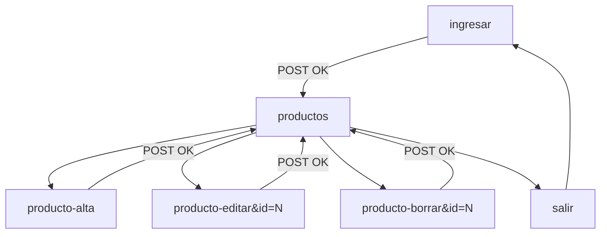

# Contrato frontend — Panel admin ABM (Galmir)

Documento de integración entre **backend (PHP/PDO)** y **frontend (HTML/CSS)** del panel de administración.

**Estado backend:** ✅ Fases B1–B6 completas (jun 2026)  
**Estado frontend:** ⬜ Pendiente — login ✅ · ABM ⬜  
**Referencia general:** [RULES.md](RULES.md)

---

## 1. Alcance

El frontend debe **reemplazar los stubs HTML** dentro de `admin/vistas/` **sin modificar** la lógica PHP del bloque superior de cada archivo (líneas antes del `?>`).

| Vista | Archivo | Backend | Frontend |
|-------|---------|---------|----------|
| Login | `ingresar.php` | ✅ | ✅ |
| Listado ABM | `productos.php` | ✅ B3 | ⬜ |
| Alta | `producto-alta.php` | ✅ B4 | ⬜ |
| Edición | `producto-editar.php` | ✅ B5 | ⬜ |
| Baja | `producto-borrar.php` | ✅ B6 | ⬜ |

---

## 2. Convenciones globales

### Routing

- Base admin: `admin/index.php?seccion={nombre}`
- Todas las rutas son **relativas** al directorio `admin/` (ej. `index.php?seccion=productos`)
- Sesión requerida en todas las secciones excepto `ingresar`
- Cerrar sesión: `index.php?seccion=salir`
- `admin/index.php` solo hace **whitelist + guard de sesión** y luego `require` de la vista (patrón docente). **No precarga datos** de productos ni categorías.

### Carga de datos (patrón docente)

Cada vista admin hace su propio `require_once` de `Producto.php` y consulta lo que necesita (igual que `noticias.php` en Saraza Basket):

| Vista | Carga en el bloque PHP superior |
|-------|----------------------------------|
| `productos.php` | `$productos = (new Producto)->todas()` |
| `producto-alta.php` | `$categorias = (new Producto)->todasCategorias()` |
| `producto-editar.php` | `$categorias = (new Producto)->todasCategorias()` + lógica de edición |
| `producto-borrar.php` | `$producto = (new Producto)->porId($id)` en GET válido |

El frontend **no debe** mover esta lógica a `admin/index.php`.

### Credenciales de prueba

| Campo | Valor |
|-------|-------|
| Email | `admin@galmir.local` |
| Password | `admin123` |

### Escape HTML (obligatorio en salidas dinámicas)

```php
<?= htmlspecialchars($valor, ENT_QUOTES, 'UTF-8') ?>
```

Aplicar en: nombres, descripciones, rutas de imagen, emails, mensajes de error.

### Estilo visual

Reutilizar la línea del login admin:

- Tipografías: **Inter** (cuerpo), **Roboto** (títulos/logo)
- CSS login existente: `admin/css/ingresar.css`
- Imagen de marca: `imgs/login-img.webp` (ruta desde raíz del sitio)
- Crear CSS del panel ABM en `admin/css/` (ej. `panel.css`, `productos.css`) — **no modificar** la lógica PHP

### Lo que NO debe hacer el frontend

- No mover la lógica POST/redirect al JavaScript
- No cambiar los `name` de los campos de formulario (ver § 4)
- No usar rutas absolutas de disco ni URLs fijas al localhost
- No eliminar el guard de sesión en `admin/index.php`

---

## 3. Pantallas y variables PHP disponibles

### 3.1 Login — `ingresar.php` ✅

**URL:** `admin/index.php?seccion=ingresar`

| Variable | Tipo | Descripción |
|----------|------|-------------|
| `$errorLogin` | `string` | Mensaje de error; vacío si no hay |
| `$emailIngresado` | `string` | Email repoblado tras error |

**Formulario POST**

| Campo | `name` | Tipo | Requerido |
|-------|--------|------|-----------|
| Email | `email` | email | sí |
| Contraseña | `password` | password | sí |

**Action:** `admin/index.php?seccion=ingresar` · **Method:** `POST`

**Comportamiento backend**

- Credenciales válidas → redirect `?seccion=productos`
- Credenciales inválidas → `$errorLogin` + email repoblado
- Ya logueado → redirect `?seccion=productos`

**Elementos decorativos (opcionales, no funcionales):** Google, Facebook, Recordarme, Olvidaste contraseña.

---

### 3.2 Listado — `productos.php` ⬜

**URL:** `admin/index.php?seccion=productos`

**Bloque PHP superior (no modificar)**

```php
require_once __DIR__ . '/../../clases/Producto.php';

$producto = new Producto;
$productos = $producto->todas();
```

| Variable | Tipo | Descripción |
|----------|------|-------------|
| `$productos` | `Producto[]` | Listado desde BD, cargado en esta vista (`Producto::todas()`) |
| `$usuarioId` | `int` | ID del admin logueado |
| `$usuarioEmail` | `string` | Email de sesión |

**Por cada `$producto` en el foreach**

| Getter | Uso en UI |
|--------|-----------|
| `getId()` | Enlaces editar/borrar |
| `getNombre()` | Columna título |
| `getPrecio()` | Columna precio — formatear con `number_format($p->getPrecio(), 0, ',', '.')` |
| `getCategoria()` | Texto concatenado de categorías |
| `getDescripcionCorta()` | Opcional en listado |
| `getImagen()` | Thumbnail opcional — ruta relativa desde raíz sitio |

**Enlaces que debe incluir la UI**

| Acción | URL |
|--------|-----|
| Nuevo producto | `index.php?seccion=producto-alta` |
| Editar | `index.php?seccion=producto-editar&id={id}` |
| Borrar | `index.php?seccion=producto-borrar&id={id}` |
| Cerrar sesión | `index.php?seccion=salir` |

**Ejemplo mínimo de fila (referencia, no copiar diseño)**

```php
<?php foreach ($productos as $producto): ?>
    <tr>
        <td><?= htmlspecialchars($producto->getNombre(), ENT_QUOTES, 'UTF-8') ?></td>
        <td>$<?= number_format($producto->getPrecio(), 0, ',', '.') ?></td>
        <td><?= htmlspecialchars($producto->getCategoria(), ENT_QUOTES, 'UTF-8') ?></td>
        <td>
            <a href="index.php?seccion=producto-editar&id=<?= (int) $producto->getId() ?>">Editar</a>
            <a href="index.php?seccion=producto-borrar&id=<?= (int) $producto->getId() ?>">Borrar</a>
        </td>
    </tr>
<?php endforeach; ?>
```

---

### 3.3 Alta — `producto-alta.php` ⬜

**URL:** `admin/index.php?seccion=producto-alta`

| Variable | Tipo | Descripción |
|----------|------|-------------|
| `$categorias` | `array` | `[['categoria_id' => int, 'nombre' => string], ...]` — cargado en esta vista |
| `$valoresAlta` | `array` | Valores repoblados del formulario |
| `$errorAlta` | `string` | Mensaje de error; vacío si no hay |

**Claves de `$valoresAlta`**

`nombre`, `precio`, `descripcion_corta`, `descripcion`, `imagen`, `categoria_id`

**Formulario POST**

| Campo | `name` | Tipo HTML sugerido | Requerido |
|-------|--------|-------------------|-----------|
| Nombre | `nombre` | text | sí |
| Precio | `precio` | number (`step="0.01"`) | sí |
| Descripción corta | `descripcion_corta` | text | sí |
| Descripción | `descripcion` | textarea | sí |
| Imagen | `imagen` | text | sí — ruta relativa ej. `imgs/teg.webp` |
| Categoría | `categoria_id` | select | sí |

**Action:** `index.php?seccion=producto-alta` · **Method:** `POST`

**Select de categorías**

```php
<select name="categoria_id" id="categoria_id" required>
    <option value="">Seleccionar…</option>
    <?php foreach ($categorias as $categoria): ?>
        <option
            value="<?= (int) $categoria['categoria_id'] ?>"
            <?= (int) $valoresAlta['categoria_id'] === (int) $categoria['categoria_id'] ? 'selected' : '' ?>
        >
            <?= htmlspecialchars($categoria['nombre'], ENT_QUOTES, 'UTF-8') ?>
        </option>
    <?php endforeach; ?>
</select>
```

**Comportamiento backend**

- Validación OK → INSERT + redirect `?seccion=productos`
- Validación fallida → `$errorAlta` + `$valoresAlta` repoblados
- Precio acepta coma o punto decimal

**Mensaje de error posible:** `Completá todos los campos obligatorios con valores válidos.`

---

### 3.4 Edición — `producto-editar.php` ⬜

**URL:** `admin/index.php?seccion=producto-editar&id={id}`

| Variable | Tipo | Descripción |
|----------|------|-------------|
| `$categorias` | `array` | Opciones del select — cargado en esta vista |
| `$valoresEdicion` | `array` | Valores pre-poblados o repoblados tras error (incluye `categoria_id`) |
| `$errorEdicion` | `string` | Mensaje de error |
| `$producto` | `Producto\|null` | Objeto cargado (GET o tras error POST) |

**Claves de `$valoresEdicion`**

`producto_id`, `nombre`, `precio`, `descripcion_corta`, `descripcion`, `imagen`, `categoria_id`

**Formulario POST**

Mismos campos que alta **más**:

| Campo | `name` | Tipo | Requerido |
|-------|--------|------|-----------|
| ID producto | `producto_id` | hidden | sí |

**Action:** `index.php?seccion=producto-editar&id={id}` · **Method:** `POST`

**Pre-poblado:** usar `$valoresEdicion` en todos los inputs (no `$producto` directamente en el HTML, para que funcione también tras error de validación).

**Comportamiento backend**

- `id` inválido o producto inexistente (GET) → redirect `?seccion=productos`
- Validación OK → UPDATE + redirect `?seccion=productos`
- Validación fallida → `$errorEdicion` + valores repoblados

---

### 3.5 Baja — `producto-borrar.php` ⬜

**URL:** `admin/index.php?seccion=producto-borrar&id={id}`

| Variable | Tipo | Descripción |
|----------|------|-------------|
| `$producto` | `Producto` | Producto a eliminar (solo en GET válido) |

**Formulario POST (confirmación obligatoria)**

| Campo | `name` | Tipo | Requerido |
|-------|--------|------|-----------|
| ID producto | `producto_id` | hidden | sí |

**Action:** `index.php?seccion=producto-borrar&id={id}` · **Method:** `POST`

**UI mínima sugerida**

- Mostrar nombre del producto: `$producto->getNombre()`
- Botón confirmar eliminar (`type="submit"`)
- Link cancelar → `index.php?seccion=productos`

**Comportamiento backend**

- GET con id inválido → redirect `?seccion=productos`
- POST → DELETE + redirect `?seccion=productos`
- **No usar** link GET directo para borrar (solo POST)

**Ejemplo mínimo de confirmación**

```php
<p>¿Eliminar «<?= htmlspecialchars($producto->getNombre(), ENT_QUOTES, 'UTF-8') ?>»?</p>
<form method="post" action="index.php?seccion=producto-borrar&id=<?= (int) $producto->getId() ?>">
    <input type="hidden" name="producto_id" value="<?= (int) $producto->getId() ?>">
    <button type="submit">Sí, eliminar</button>
    <a href="index.php?seccion=productos">Cancelar</a>
</form>
```

---

## 4. Resumen de `name` en formularios

| Vista | Campos `name` |
|-------|---------------|
| Login | `email`, `password` |
| Alta | `nombre`, `precio`, `descripcion_corta`, `descripcion`, `imagen`, `categoria_id` |
| Edición | `producto_id`, `nombre`, `precio`, `descripcion_corta`, `descripcion`, `imagen`, `categoria_id` |
| Baja | `producto_id` |

**No renombrar estos campos** — el backend los lee exactamente así.

---

## 5. Flujos de navegación



---

## 6. Checklist de pruebas (frontend)

Marcar al integrar cada pantalla:

### Listado
- [ ] Muestra los 6 productos seed desde BD
- [ ] Enlaces Editar/Borrar llevan al `id` correcto
- [ ] Botón/link Alta funciona
- [ ] Cerrar sesión redirige al login

### Alta
- [ ] Select muestra las 5 categorías
- [ ] Alta válida aparece en listado público y admin
- [ ] Error de validación muestra `$errorAlta` y repuebla campos
- [ ] Redirect a listado tras éxito

### Edición
- [ ] Formulario llega pre-poblado con `$valoresEdicion` (incluye `categoria_id`)
- [ ] Categoría actual seleccionada en el select (`$valoresEdicion['categoria_id']`)
- [ ] Cambios persisten en BD y sitio público
- [ ] `id=999` redirige al listado (backend)

### Baja
- [ ] Muestra nombre del producto a eliminar
- [ ] POST elimina y redirige al listado
- [ ] Cancelar vuelve sin borrar
- [ ] Producto desaparece del sitio público

### General
- [ ] `htmlspecialchars()` en todas las salidas dinámicas
- [ ] HTML5 semántico (`section`, `form`, `label`, `table`/`article` según diseño)
- [ ] CSS coherente con login admin

---

## 7. Archivos que puede crear/modificar el frontend

| Archivo | Acción permitida |
|---------|------------------|
| `admin/vistas/productos.php` | Reemplazar HTML **debajo** del bloque PHP |
| `admin/vistas/producto-alta.php` | Idem |
| `admin/vistas/producto-editar.php` | Idem |
| `admin/vistas/producto-borrar.php` | Idem |
| `admin/css/*.css` | Crear/editar estilos del panel |
| `admin/vistas/ingresar.php` | Solo ajustes visuales (backend ya integrado) |

| Archivo | No modificar sin coordinar |
|---------|---------------------------|
| `admin/index.php` | Router, sesión, guard (sin carga de datos) |
| `clases/Producto.php` | CRUD PDO (`crear`/`actualizar` reciben un `int $categoriaId`) |
| `clases/Usuario.php` | Login/sesión |
| `clases/DBConexion.php` | Conexión BD |

---

## 8. Contacto / dudas de integración

Si un campo no persiste o el redirect falla, verificar en este orden:

1. ¿El `name` del input coincide con § 4?
2. ¿El form usa `method="post"`?
3. ¿Hay sesión activa (`admin@galmir.local`)?
4. ¿MySQL MAMP está corriendo y la BD importada?

Ante cambios en nombres de campos o flujos POST, **actualizar este contrato y avisar al backend**.
